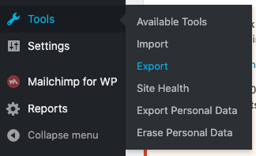

*I hope you know what Scully is, because this post is not about how to start with Scully but example how to migrate your WordPress blog content into Scully.*

## Export posts

First thing you need to do is to export all your post from WordPress. Luckily for us WordPress has functionality to export all your posts into XML.
You can find option in navigation:



You can check more details on WordPress [official documentation](https://wordpress.org/support/article/tools-export-screen/).

After this operation you have your XML file, but it's still XML and you would like to have MD.

## XML to MD

To convert XML into MD within keeping blog format we can use [wordpress-export-to-markdown](https://github.com/lonekorean/wordpress-export-to-markdown) tool:


Answer prompt questions carefullly because for you ideally to keep the same structure of URLs.

Convertion finished? Wel done! Now you have you md files with images. doesn't Scully support images with md?

## Blog images and Scully

Bad news for you. For now (8.06.20) Scully does not recognise images. 
Good news - Scully has plugin system. 
This article not about Scully plugins, so if you want to know how to write Scully plugins please check [this](https://samvloeberghs.be/posts/custom-plugins-for-scully-angular-static-site-generator) article  by [Sam Vloeberghs](https://twitter.com/samvloeberghs), it's great!

## Scully plugin to copy images

We want scully to copy images from source of md files to compiled html files. For this we will create a small image plugin(image.scully.plugin.ts):

```typescript
export function imageFilePlugin(raw: string, route: HandledRoute) {
  return new Promise((resolve) => {
    fs.copyFile(route.templateFile, './dist/static/images/' + route.data.sourceFile, (err) => resolve(''));
  });
}
```

There is no yet neither `./dist/static` directory, no `./dist/static/images`, so you need to create them:

```typescript
if (!fs.existsSync('./dist/static')) {
  fs.mkdirSync('./dist/static');
}
if (!fs.existsSync('./dist/static/images')) {
  fs.mkdirSync('./dist/static/images');
}
```

Now we need to register our plugin for all types of images that we want to support(you can add more if you need):

```typescript
registerPlugin('fileHandler', 'png', imageFilePlugin);
registerPlugin('fileHandler', 'jpg', imageFilePlugin);
registerPlugin('fileHandler', 'gif', imageFilePlugin);
```

after some pretification the final version of our image plugin (image.scully.plugin.ts):

```typescript
import { registerPlugin, HandledRoute } from '@scullyio/scully';
import * as fs from 'fs';

if (!fs.existsSync('./dist/static')) {
  fs.mkdirSync('./dist/static');
}
if (!fs.existsSync('./dist/static/images')) {
  fs.mkdirSync('./dist/static/images');
}

export function imageFilePlugin(raw: string, route: HandledRoute) {
  return new Promise((resolve) => {
    const src = route.templateFile;
    const dest = './dist/static/images/' + route.data.sourceFile;
    fs.copyFile(src, dest, (err) => {
        if (err) {
          console.log(err);
        }
        console.log(`${route.templateFile} was copied to ${dest}`);
        resolve('');
      }
    );
  });
}

registerPlugin('fileHandler', 'png', imageFilePlugin);
registerPlugin('fileHandler', 'jpg', imageFilePlugin);
registerPlugin('fileHandler', 'gif', imageFilePlugin);
```


and now we need to include this plugin to Scully config (scully.blog.config.ts):

```typescript
import './src/image.scully.plugin';

export const config = {
  ...

```

## Parse tags from XML

Ideally to have tags from your posts as well. By defalt [wordpress-export-to-markdown](https://github.com/lonekorean/wordpress-export-to-markdown) does not parse tags. I've created [PR](https://github.com/lonekorean/wordpress-export-to-markdown/pull/40) for it. Not sure how fast it's gonna be merged, so if you need tags you can use [my forked version](https://github.com/stevermeister/wordpress-export-to-markdown).


## Double enconding

It looks like there is an issue with WordPress XML Export, if you have many non-latin symbols, for example, you are writing your posts in other language it will be encoded 2 times, so when I did export (with [wordpress-export-to-markdown](https://github.com/lonekorean/wordpress-export-to-markdown)), I changed [this line](https://github.com/lonekorean/wordpress-export-to-markdown/pull/41/files#diff-6947033678b93d106e25614dd972e66fR45).


# Angular Services: articles, tags, search

When you have all your information in place (in .md files) you could think about such a nice and obvious functionality for WordPress (as well as any blog) like **tags** or **search**, and now you can do it all on client side!


## Article Service

First of all let's create our main service - Articles Service to manipulate with all the content. We will use `scully.available$` stream for this, so: 

```typescript
getArticles(): Observable<Article[]> {
  return this.scully.available$;
}
``` 

but it's not that easy, if you have not only *.md files Scully will create item for each file (yes, also for images), I opened [an issue](https://github.com/scullyio/scully/issues/653) and hope it's gonna be closed soon, but for now you need to filter only *.md files, so: 

```typescript
this.scully.available$.pipe(
      map((articles: Article[]) => articles.filter((article: Article) =>
        article.sourceFile?.split('.').pop() === 'md')));
``` 

for each article you have a date, so I would like it to be ordered - new ones on top:

```typescript
map((articles: Article[]) => {
  return articles.sort((articleA, articleB) => {
    return +new Date(articleB.date) - +new Date(articleA.date);
  });
})
``` 

it's also convenient to have a limit:

```typescript
map(articles => articles.slice(0, limit))
```

here are we are:

```typescript
  getArticles(limit = 10): Observable<Article[]> {
    return this.scully.available$
      .pipe(
        tap(articles => console.log(articles)),
        map((articles: Article[]) => articles.filter((article: Article) =>
          article.sourceFile?.split('.').pop() === 'md')),
        map((articles: Article[]) => {
          return articles.sort((articleA, articleB) => {
            return +new Date(articleB.date) - +new Date(articleA.date);
          });
        }),
        map(articles => articles.slice(0, limit))
      );
  }
```  

With help of Article Service now you can output preview list of your articles: https

```html
<app-article-preview [article]="article" *ngFor="let article of articles$|async"></app-article-preview>
```


## Tags Service

Based on ArticleService we can get all the tags, also with counter for each one that we can create a tag cloud after:

```typescript
getTags(): Observable<Tag[]> {
  return this.articleService.getAllArticles().pipe(map(articles => {
    const tags = [];
    articles.forEach(article => {
      if (!article.tags){
        return false;
      }
      article.tags.split(',').map(articleTag => articleTag.trim()).forEach(articleTag => {
        const tag = tags.find(ctag => ctag.title === articleTag);
        if (tag) {
          tag.count++;
        } else {
          tags.push({
            title: articleTag,
            count: 1
          });
        }
      });
    });
    return tags.filter(tag => tag.count > 3);
  }));
}
```

## Search

It would be sad if your blog did not have an option to seach (or to filter by tag). We already have ArticleService, so what we only need to do is to filter by tag or search query:

```typescript
getFilteredArticles(tag: string, searchTerm: string, limit: number = 10): Observable<Article[]> {
  return this.getAllArticles().pipe(
    map( (articles: Article[]) => {
      return articles.filter((article) => {
        if (!tag) {
          return true;
        }
        else if (!article.tags) {
          return false;
        }
        return article.tags.includes(tag);
      });
    }),
    map(articles => articles.filter(article => {
      if (!searchTerm) {
        return true;
      }

      return article.title.includes(searchTerm) || article.tags.includes(searchTerm);
    })),
    map(articles => articles.slice(0, limit))
  );
}
```

Isn't it cool to have everything on frontend with search that executes for less than a second? 


## Code Highlight

Btw, if you don't know you can also highlight your code blocks (i.e. <pre><code class="language-typescript"></code></pre>).
For this you only need to add one line in your scully config (scully.blog.config.ts):

```typescript
setPluginConfig('md', { enableSyntaxHighlighting: true });
```

because by default it's switched off. 


## All the helpful resources

- You can find all the code [here](https://github.com/stevermeister/blog).
- And the site is life so you can play around - [https://blog.stepansuvorov.com/](https://blog.stepansuvorov.com/)
- [Scully Docs](https://scully.io/docs/features/)
- "[Custom plugins for Scully](https://samvloeberghs.be/posts/custom-plugins-for-scully-angular-static-site-generator)" by Sam Vloeberghs
