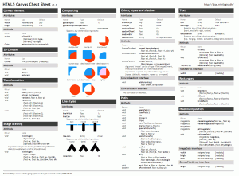
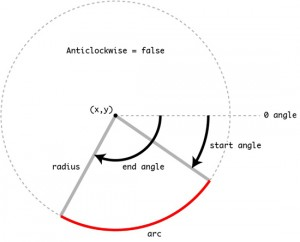
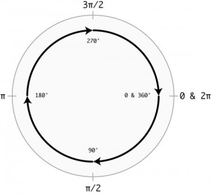

Наконец-то появилось время разобрать принципы анимации с использованием HTML canvas элемента.

Вот что получилось:

 Подробности под катом.

Итак поехали:

<canvas id="tutorial" width="150" height="150"></canvas>

\- добавляем HTML элемент в страницу. Для рисования необходимо обратиться к нему на javascript и получить контекст:

var canvas = document.getElementById('tutorial');
var ctx = canvas.getContext('2d');

На данный момент 2д - единственный возможный контекст, поэтому с этим тоже не заморачиваемся.

Вот мы и перешли к самой интересной части - нанесение изображения. Объект контекста содержит много различных методов, например:

ctx.fillRect (5, 5, 55, 50); // рисуем прямоугольник

Мы можем задать стиль для нашего прямоугольника:

ctx.fillStyle = "rgb(35, 200, 35)"; // сначала задаем стиль
ctx.fillRect (5, 5, 55, 50); // потом рисуем прямоугольник

Вроде бы все просто. Все методы, понятное дело, разбирать не будем. Вот есть схемка, которая поможет:

А в чем заключается анимация? В том что мы по времени перерисовываем картинку, или другими словами - меняем координаты/параметры движимых объектов.

Как видите ничего сложного нет. Нужны только фантазия и справочник по методам.

С кодом примера можно поиграться вот тут: http://learn.javascript.ru/play/lZqarb

Добавлю еще две иллюстрации, которые я нашел в сети, о том как рисовать дуги:

arc(x, y, radius, startAngle, endAngle, anticlockwise);

О принципе отсчета угла: 

О радианах:

[Источник](http://net.tutsplus.com/tutorials/javascript-ajax/canvas-from-scratch-advanced-drawing/) этих прекрасных эскизов.
