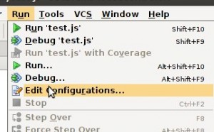

Проходя [курсы по mongoDb](https://education.10gen.com) остро стала необходимость в организации какой-то **песочницы** для скриптов, так как просто в **mongoshell** писать стало не удобно, а отдельно писать в редакторе код, а потом его запускать через консоль - тоже не интересно.

Покопавшись в плагинах **WebStorm** (который является моим текущим IDE), я обнаружил, что для **mongoDb** расширения, увы, еще нет. Ну что же, играем дальше. Есть плагин на **node.js**, который довольно просто настраивается. После чего можем в настройках запуска проекта

добавить вариант запуска текущего скрипта нодой.

Надеюсь, вы не забыли поставить [монго драйвер на ноду](http://stepansuvorov.com/blog/2012/10/node-js-%D0%B8-mongodb/).

Итак, у нас есть удобный редактор, подключенная нода и консольный вывод в самом редакторе. Осталось только накидать код:

var mongo = require('mongodb');
var host = 'localhost';
var port = mongo.Connection.DEFAULT\_PORT;

var db = new mongo.Db('test', new mongo.Server(host, port, {}), {safe:false});
db.open(function(err, db) {
    console.log("Connected!");

    // а вот тут и пишем наш код, который хотим отладить

    db.close();
});

Happy codding!
