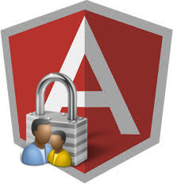

Изучив кучу инструкций по сборке различных моделей велосипедов я таки собрал свой. Будет хорошо, если пост поможет сэкономить кому-то время на конструирование.

**UPD**: Статья обновлена и дополнена **2017-02-21**

# Отдельный модуль

Так как я сторонник модульного подхода и считаю, что именно это правильный способ использования **AngualrJS**, то весь функционал связанный с авторизацией я сложил в отдельный модуль **auth**. К нему подключаю модуль управления [кукисами](https://docs.angularjs.org/api/ngCookies/service/$cookies) и модуль организации удобной работы с **REST**([restangular](https://github.com/mgonto/restangular "github.com/mgonto/restangular")):

\[javascript\]angular.module('auth', \['ngCookies', 'restangular'\]);\[/javascript\]

## Сервис авторизации

Понятное дело, что какой бы вы самокат не делали, без сервиса не обойтись. Что в нем должно находиться? Делаем REST/token вариант авторизации, поэтому в сервисе будет следующий функционал:

- авторизация по логину (асинхронная операция: POST запрос и получение/сохранения токена)
- авторизация по токену (асинхронная операция: GET запрос и получение информации по пользователю)
- проверка статуса (синхронная операция)
- логаут (зачистка данных авторизации - токена)

Вот упрощенная версия кода(выкинул обработку ошибок):

\[javascript\]angular.module('auth') .service('AuthService', function($cookies, $http, Restangular) { 'use strict';

var self = this; this.status = { authorized: false, };

this.loginByCredentials = function(username, password) { return Restangular.all('sessions').post({ email: username, password: password }) .then(function(response) { return self.loginByToken(response.contents); }); };

this.loginByToken = function(token) { $http.defaults.headers.common\['X-Token'\] = token;

return Restangular.all('sessions').get(token) .then(function(response) { $cookies.accessToken = token; self.status.authorized = true; return response; }); };

this.logout = function() { self.status.authorized = false; $cookies.accessToken = '';

Restangular.all('sessions').remove(); }; });\[/javascript\]

Приходится подключать **$http** сервис для вот этого хака:

\[javascript\]$http.defaults.headers.common\['X-Token'\] = token;\[/javascript\]

\- по другому в **Restangular** не получается динамически задать хедер, в котором мы хотим отправлять токен авторизации.

(если у вас есть другое решение данной ситуации - пожалуйста поделитесь)

## Страница авторизации

Если вы используете стандартный ангуляровский роутер, тут может возникнуть вопрос: Как для авторизации показывать другой лэйаут?

Решение подсказал [Валентин Шибанов](http://olostan.name/ "olostan.name"), который предложил завернуть все содержимое(в том числе **ui-view**) в **ng-if**, который бы в зависимости от того, авторизираван пользователь или нет, показывал бы либо содержимое с меню либо формочку авторизации.

Итого имеем(опять очень упрощенная версия):

\[html\] 
 <menu></menu> <ui-view></ui-vew> 
 <login></login> 
 \[/html\]

## Плюшки с интерсепторами

Если переодически пропадает сессия с сервером(таймаут), но клиент остается активным, и вы хотите восстановить сессию без привлечения пользователя, можно посмотреть в сторону [интерсепторов](http://stepansuvorov.com/blog/2014/04/angularjs-interceptors-%D0%BF%D1%80%D0%B8%D0%BC%D0%B5%D1%80%D1%8B/). Так же интерсепторы можно использовать для общей обработки ошибок авторизации.

## Момент определения состояния авторизации и ограничение доступа

Давайте разберемся, в какой момент мы должны/можем проверять состояние авторизации. Все варианты можно условно разбить на 2:

- ответ API (мы узнали от сервера)
- изменение состояния (перешли на другую страничку)
    - событие изменение состояния
    - резолв конкретного стейта

Давайте посмотрим на все случаи.

## Ответ от API и интерсептор для обратки ошибки

Про интерсепторы можно более подробно почитать [тут](http://stepansuvorov.com/blog/2014/04/angularjs-interceptors-%D0%BF%D1%80%D0%B8%D0%BC%D0%B5%D1%80%D1%8B/). Мы с вами реализуем один из них интесептор ошибки ответа:

\[javascript\] app.service('authRejector', function($q) { this.responseError = (rejection) => { if (rejection.status === 401) { //делаем какие-то действия для пользователя без авторизации }

return $q.reject(rejection); }; }); \[/javascript\]

и потом подключаем наш интерсептор к остальным:

\[javascript\] app.config(function($httpProvider) { $httpProvider.interceptors.push('authRejector'); }); \[/javascript\]

## Изменение стейта

Навесить хук в событие **ui-router** можно с помощью сервиса **$transitions**:

\[javascript\] $transitions.onEnter({ to: 'stateName' }, function($state$, $transition$) { if(!AuthService.status.authorized){ //делаем какие-то действия для пользователя без авторизации return $q.reject() } } \[/javascript\]

## Запрет доступа к страница с помощью резолв

Давайте предлополжим, что у нас есть стейт **users**:

\[javascript\] .state('users', {}) \[/javascript\]

к которому мы хотим ограничить доступ. Для этого добавим резолв с использованием все того же сервиса авторизации:

\[javascript\] .state('users', { resolve: { auth: function($q, AuthService) { if(!AuthService.status.authorized) { $q.reject(); alert('Вы должны авторизироваться!'); } } } }) \[/javascript\]

## Проверка авторизации при переходе на другую страницу

В **ui-router** мы можем навесить хук на событие перехода на какой либо стейт с помощью сервиса **$transitions**:

\[javascript\] $transitions.onEnter({ to: 'stateName' }, function($state$, $transition$) { if(!AuthService.status.authorized){ //делаем какие-то действия для пользователя без авторизации return $q.reject() } } \[/javascript\]

Но у приведем сам логин компонент для полноты примера.

## Пример логин компонента

\[javascript\] app.component('login', { controller: function(AuthService){ this.login = function(login, password) AuthService.loginByCredentials(login, password).catch(function(){ //выводим ошибку авторизации }); } }); \[/javascript\]
