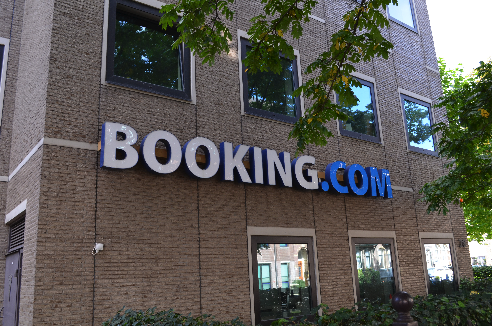

Небольшой рассказ о собеседовании в компании **Booking.com**

Раз вы уже открыли подробное описание этого поста, думаю вам не нужно рассказывать, что за компания **Booking.com**.

Сервисом бронирования отелей пользуюсь уже очень давно, и он мне по прежнему нравится.

Никогда не задумывался, что эта компания имеет голландские корни, пока не отправился в командировку в Нидерланды и, гуляя по Амстердаму, не наткнулся на их офис (точнее баннер).

позже оказалось, что это первый офис компании. На здании сохранился баннер, а они уже давно переехали в более просторное помещение.

С того момента загорелся желанием попасть в команию. Почему бы и нет? Почему не заняться самому улучшением сервисов, которым пользуешься?

Время шло, и по иронии судьбы у меня появились знакомые из этой компании - я начал узнавать более подробно о "кухне". Как построен процесс разработки, какие новые технологии используются, в общем все, что прячется за этим красивым брендом.

К сожалению, информация, которая поступала ко мне из разных источников, разбавила четкость компании моей мечты.

диалог о технологиях(сначала я расказал с чем сам работаю):

_\- Думаю тебе будет у нас скучно._ _\- Чего так?_ _\- Ну ты работаешь со всеми этими фреймворками, а мы их не используем. _ _\- Ну какой-то фреймворк _вы используете_ ?_ _\- jQuery_ _\- Ну для организации структуры кода и архитектуры приложения_ _\- jQuery_

...

_\- И что неужели все только говнокодят?_ _\- А почему нет? Компания платит за это хорошие деньги и предоставляет хорошие улсловия. Никто не парится. Есть конечно идейные ребята, которые пытаются что-то улучшить с точки зрения кода, но без какой-либо мотивации со стороны компании._ _\- Без шансов что ситуация измениться в будущем?_ _\- Пока этот такой подход приносит компании миллионы - нет. Мы можем только мечтать об этом._

Итого, у меня сложилось такое ИМХО.

**Что хорошего есть в компании**: активно развивающаяся и растущая компания, плоская структура и открытость к вашим бизнес - предложениям, современный офис в центре Амстердама, прекрасные рабочие места, обеды, соцпакеты, тренинги личностного роста, корпоративы, хостинг конференций и очень хорошие условия для релокейта.

**Что плохого**: код, код, и для тех кто не слышал первые 2 раза - КОД. А самое страшное - у боссов компании даже и в мыслях нет что-то модернизировать. Серверный код до сих пор написан на перле. Для компании уже очень трудно находить разработчиков для поддержания такого монстра и теперь они занялись набором просто людей с "_willing to lear pearl_".  Професионального развития в комапнии можно не ждать.

Перейдем к собеседованию

Для всех собеседуемых проводят 3-4 собеседования:

- по телефону, с HR по общим вопросам(тест адекватности)
- по телефону, техническое, с двумя специалистами
- в офисе, техническое, более детальное со специалистами
- в офисе, с менджером

часто объединяют собеседования 3-4, а иногда бывает сокращают 2.

## Собеседованине первое

~30 минут. На нем уточняются вопросы по информации вашего CV. Задаются общие вопросы уровня "а знаете ли что такое JavaScript?". Последний вопрос был о [A/B тестировании](https://ru.wikipedia.org/wiki/A/B-%D1%82%D0%B5%D1%81%D1%82%D0%B8%D1%80%D0%BE%D0%B2%D0%B0%D0%BD%D0%B8%D0%B5 "ru.wikipedia.org"), которое в букинге безумно любят.

## Собеседование второе

\= 1 час Вам звонят на скайп (либо на телефон). В собеседоние принимают участие 2 тех специалиста booking.com. Сначала идут примитивные вопросы по HTML/CSS, далее немного JavaScript. После чего предлагают выполнить простое задание в онлайн редакторе ( в моем случае это была валидация полей формочки ).

Следующим этапом идет обсуждение на тему "ваши предложения по улучшения сервиса, и как бы вы это протестировали, по каким параметрам оценивали бы результат" - к этому вопросу желательно подготовится заранее. Для меня это большого труда не составило, ибо, как уже было упомянуто, сайтом я пользуюсь не один год.

## Fail

После второго собеседования ответа ждал довольно долго. Компания не давала о себе знать где-то еще недели 2-3. После чего мне пришло письмо стандартное письмо, в котором вероятно подставили только одно предложение для моего случая:

_The interviewers were impressed with your experience with data, testing and suggestions for our website. They however felt your technical skills are not strong enough to be succesful in this position._

Меня это больше удивило, чем расстроило. Потому как в процессе интервью я не испытывал каких либо сложностей в технических вопросах. Конечно же, я тут же запросил более детальной информации. Ответа жду до сих пор (а прошел уже почти год на момент публикации поста).

## Собеседование третье оно же четвертое

Далее далее повествование идет не от меня, но я все же посчитал что логичнее было бы завершить описание процедуры и уделить немного внимания заключительной части.

_Стандартное интервью:_ _1) Интервьюеры рассказали о себе, чем занимаются_ _2) Рассказал о себе_ _3) Дали несложную задачу - поиск целых в массиве по какому-то предикшену, уже точно не помню_ _4) Набросал реализацию, попросили оценить алгоритмическую сложность, спросили как можно улучшить_ _5) Спросили есть ли вопросы_ _скучное и неинтересное, как и сам booking.com )_

## Что-то типа выводов

Несмотря минусы, которые были описаны в посте, я по прежнему считаю, что **Booking.com** - идеальная компания для релокейта в Амстердам. Процесс интервью пропитан бюрократией, как в принципе и во всех крупных корпорациях. Компания, скорее всего, больше оценит ваше понимание принципов A/B тестирования, чем конкретные технические знания.
