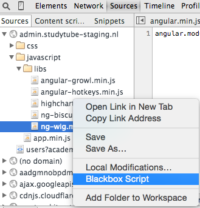
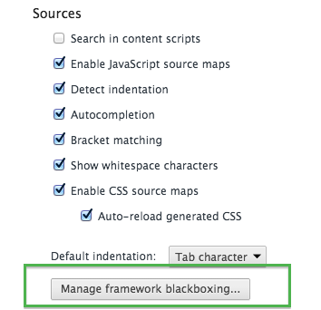

Probably you already know that **Chrome** now allows to put script source file to **blackbox** (or simply to ignore it during **debug**). It helps to avoid jumping inside 3rd party library and debugging it instead of focusing on own code.

You can add script to the blackbox by right click on file in the source tab:

and the blackbox management is placed in Web Developer settings:

More info on [official site](https://developer.chrome.com/devtools/docs/blackboxing "developer.chrome.com").
