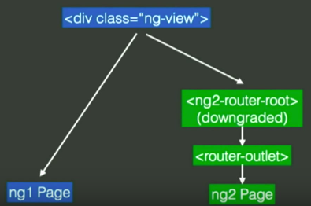

Several days ago I had a chance to visit ngEurope conference. It was 2 nice intensive days filled with presentations. If by some reason you were not there and don't have time to watch all 16 hours I made some notes for you.

# First Day

# Keynote (slides coming soon, [video](https://www.youtube.com/watch?v=wpxnU62mNJ4))

[Miško Hevery](https://twitter.com/mhevery) made this presentation in so automatic mode like he made the same one more than 10 times already: looking in one point and reading text learned by heart. Check it out: he was alive first 1-2 minutes - rest was for robot that was reading the text.

Key points:

- focus not only on web but also mobile and desktop apps
- Angular2 is not a framework, but a platform
- performance part: lazy loading, property tricks
- detailed errors
- explanation of change detection options
- a bit about tools (angular-cli, augury)
- several words about AoT
- and Angular Universal

I think it's good talk to have something like general overview of all the coming conference topics.

# Angular & RxJs ([slides](https://docs.google.com/presentation/d/1Q4raWgWEkhJsPNWD9O_67kIc3PtkwebppqRFhFPKQVE/edit#slide=id.p), [video](https://www.youtube.com/watch?v=WWR9nxVx1ec))

**[Rob Worman](https://twitter.com/robwormald)** with his favourite topic - **reactive programming**. Where could we find reactive approach in ng2?

- Forms
- Http
- Async pipe
- Router
- @Query

Next Rob provided example of [typeahead](https://twitter.github.io/typeahead.js/) component building with ng2 and RxJs. Step by step with explanations. It's the best quick start with RxJs that you could find. Strictly recommend if you did not have experience with reactive programming before.

Nice parts to take if you already working with RxJs:

- method **[let()](https://github.com/Reactive-Extensions/RxJS/blob/master/doc/api/core/operators/let.md)** and taking out common part of the sequence
- try to avoid using **async pipes** in many places (better to combine them in one on component params level)
- future plans: to make **Observable.fromEvent** even more easy to use with **@ObserveChild**, **@ObserveChildren** decorators:

# Angular BatScanner ([slides](https://docs.google.com/presentation/d/15zkae091b57jYbYTwOyv0uO-13KpYqs3_DI_dsU5CRA/edit?usp=drive_web), [video](https://www.youtube.com/watch?v=2DHpmyFWULQ))

It was quick presentation of chrome extension for inspecting Angular2 application performance (**[BatScanner](https://chrome.google.com/webstore/detail/angular-batscanner/gcngciildkejiapchdgpcniflijoiadf)**) by **[Douglas Duteil](https://twitter.com/douglasduteil)**. Also Douglas showed the way of creating "hooks for hooks" and compiler injections to reach the goal.

# Widgets for Angular2 ([slides](https://pkozlowski-opensource.github.io/ng-europe-2016), [video](https://www.youtube.com/watch?v=l8OHU-TEG7g))

**[Pawel Kozlowski](https://twitter.com/pkozlowski_os)** named his talk even "_Custom widgets for Angular2? Piece of cake!_".

Let me retell you all the ingredients:

- clear inline bindings                                                     
- usage of **[<template> tag](https://developer.mozilla.org/en/docs/Web/HTML/Element/template)**
- css encapsulation
- rxjs
- ngZone for async update of the DOM
- nice template shortcuts                                  
- change detection strategies
- server side rendering
- animations
- UI-toolkit ([ng-bootstap](https://ng-bootstrap.github.io/#/home))

# Data science with angular ([video](https://www.youtube.com/watch?v=ZVEp9K_cynU&list=PLhc_bKwZngxW87YmkOpe77reW9N958qFN&index=8))

Pretty funny speaker, [Ari Lerner](https://twitter.com/auser). His virtual machine with slides crashed and after some unsuccessful tries we switched to next(Unit Tests) speaker.

# Unit Tests for Angular2 Applications([slides](https://docs.google.com/presentation/d/1fFxQvx2WHFPqR4piq0oWgKBuSMvrCwc1vfYggHlYEbQ/edit#slide=id.p), [video](https://www.youtube.com/watch?v=dVtDnvTLaIo))

Frankly speaking did not get [Vikram Subramanian](https://twitter.com/vikerman) presentation: for developers who already worked with ng2 unit-tests it should be obvious, but for the rest it was not clear enough.

May be it was extra difficulty to focus on subject because of previous presentation confusion.

# Embedded hybrid features in Mobile Banking App ([video](https://www.youtube.com/watch?v=kmNRgOLZhXQ&list=PLhc_bKwZngxW87YmkOpe77reW9N958qFN&index=6))

I would say that [Willem Veelenturf](https://twitter.com/wilmveel) presented not really technical topic. His experience how they make ionic application with the same performance as native app and the main idea(if I'm not mistaken) that they created own cordova plugins and integrate them with existing ionic app. And it was a statement that ING baking app(that they made) is the best in Netherlands. Sorry Willem, but it's obvious that ABN AMRO mobile app is the best in NL ;)

# Security in Angular2 ([video](https://www.youtube.com/watch?v=WN-XczmI-LY&list=PLhc_bKwZngxW87YmkOpe77reW9N958qFN&index=7))

[Martin Probst](https://twitter.com/martin_probst) and [Raphaël Jamet](https://twitter.com/7261706861656c) provided nice hints how Angular2 helps you to prevent XSS vulnerabilities and how not to brake it.

It was all about sanitizing the data. And it's good for all of us that Angular provides sanitizer from box. More over it knows about different contexts and it will not try to sanitize "<script>" tag if it's URL resource.

But sometimes you need to output content that can not be sanitized by Angular, for example you want to place youtube video(that is not provided from your domain) on your site. In this case you need to do sanitization yourself, and don't be lazy by just using **_bypassSecurityTrustResourceUrl_** method to switch of Angular one!

# Gettings to Angular2 (slides coming soon, [video](https://www.youtube.com/watch?v=2b-tEis9k4M&list=PLhc_bKwZngxW87YmkOpe77reW9N958qFN&index=10))

It was a talk by [Jen Bourey](https://twitter.com/jbourey) about **ng1/ng2** migration. Most part of the presentation was about **ngUpgrade** tool. And the most efficient way - page oriented upgrade:

and it's possible with parallel routing:

Everything had been shown on live demo together with lazy loading.

**!important**: **$compile** service will not work if you try to update ng1 directive to ng2.

[ngupgrade-example](https://github.com/bourey/ngupgrade-example) on github.

**UPD**: nice article by Victor Savkin - [Migrating Angular 1 Applications to Angular 2 in 5 Simple Steps](https://vsavkin.com/migrating-angular-1-applications-to-angular-2-in-5-simple-steps-40621800a25b#.rymu2uexu).

# Typescript latest ([video](https://www.youtube.com/watch?v=o8YI2hvassE&list=PLhc_bKwZngxW87YmkOpe77reW9N958qFN&index=9))

The most part of the talk by [Daniel Rosenwasser](https://twitter.com/drosenwasser) was about why we should use Typescript, but not about new features as title said. It was live coding where Daniel showed that you should not be afraid of Typescript and it's really easy to switch from EcmaScript 2015. And then it was angular1 example how to write it with Typescript. And finally at the end of the talk we started with new features:

- easy types with **@types**
- nullable types

and for **TS2.1**:

- async/await
- [Object Rest & Spread](http://www.typescriptlang.org/play/#src=let%20someArray%20%3D%20%5B1%2C%202%2C%203%2C%204%2C%205%5D%3B%0D%0Alet%20someObject%20%3D%20%7B%20a%3A%201%2C%20b%3A%202%2C%20c%3A%203%2C%20d%3A%204%2C%20e%3A%205%7D%3B%0D%0A%0D%0Alet%20copyOfSomeArray%20%3D%20%5B%20...someArray%20%5D%3B%0D%0Alet%20copyOfSomeObject%20%3D%20%7B%20...someObject%20%7D%3B%0D%0A%0D%0Alet%20concatOfArrays%20%3D%20%5B...someArray%2C%20...someArray%5D%3B%0D%0Alet%20mergeOfObjects%20%3D%20%7B...someObject%2C%20...someObject%20%7D%3B%0D%0A%0D%0Alet%20%5Ba1%2C%20b1%2C%20c1%2C%20...rest1%5D%20%3D%20someArray%3B%0D%0Alet%20%7Ba2%2C%20b2%2C%20c2%2C%20...rest2%7D%20%3D%20someObject%3B):
    - copy
    - merge/concat
    - destructure

# AngularFire2 and you (slides coming soon, [video](https://www.youtube.com/watch?v=uLzMOaFt6vc&list=PLhc_bKwZngxW87YmkOpe77reW9N958qFN&index=11))

[Erik Haddad](https://twitter.com/erikhaddad) just made promotion for **Firebase**. Nothing new. May be it could be nice intro for developers who are just starting with Firebase.

And, yes, **AngularFire2** has reactive approach based on **Observables** that's nice!

# Second Day

## Angular CLI & You ([video](https://www.youtube.com/watch?v=LN2xvQqAo-g))

It was a story from **[Hans Larsen](https://twitter.com/hanslatwork)** that started with explanation how painful was the process of working with ng1 environment.

And with angular-cli you everything from box:

- ng new
- ng build
- ng serve
- ng test/ ng e2e
- ng generate ...  - that will do not only code scaffolding for you but also all the imports

So:

- compile SASS/LESS
- TypeScript transpiration
- Building
- Asset optimisation
- Live reload via websockets
- Environment file(dev/prod configuration)
- Also!: AoT and Tree Shacking

And some words what's coming:

- FASTER
- Split CLI and Toolkit
- Refactoring tools (mostly for updating Angular versions)
- Addons and scripting
- Library development

And after the presentation I also asked Hans about future plans for creating ng2 module library that could be easily integrated into cli, so you can install and apply any ng2 3rd party module by one command like:

ng install material

but unfortunately there are still no plans of doing it in nearest future.

## Angular2 Applications with Augury ([video](https://www.youtube.com/watch?v=YaDFDGS3EFM))

It was introduction of the most powerful(current moment) chrome extension to debug and analyse Angular2 applications - [**Augury**](https://augury.angular.io/) by **[Vanessa Yuen](https://twitter.com/vanessayuenn)**. She announced this tool like "not just a debugger"

So what does it do for you:

- component relations
- detailed component info & editable properties
- dependancy diagram
- change detection strategy
- router structure

After it was live demo with debugger Fish Game and explanation what is under the hood of Augury: it's build with Angular2 and with using its debug API.

Roadmap:

- bugfix
- injector graph improvements
- native platform support

## Getting Universal with Angular2 ([video](https://www.youtube.com/watch?v=faWCLmYsFQ8))

**[Wassim Chegham](https://twitter.com/manekinekko)** explained what is **Angular Universal** and when should we care about server side.

Why:

- SEO
- link preview (for social media)
- **web app gap** (or first page rendering)

How to sync the state between first page rendered on server and real spa? It's manager by special script **preboot.js** that records all the events before single page application is loaded and tries to reproduce it after.

To start:

\[javascript\] import { UniversalModule } from 'angular2-universal/browser' \[/javascript\]

and for server side:

\[javascript\] import { UniversalModule } from 'angular2-universal/node' \[/javascript\]

There are a lot of renders for different node frameworks, for example **express**.

There is [Angular-Universal node starter](https://github.com/angular/universal-starter).

**Angular-cli** support is coming soon.

## From UI-Router to Component Router (slides coming soon, [video](https://www.youtube.com/watch?v=vQFImWHxCDM))

Very good structured talk about routers by **[Nir Kaufman](https://twitter.com/nirkaufman)**, really recommend you to watch this presentation have more deep understanding of routers in general:

- states
- use hash
- tracing events
- template syntax
- nested states + lazy loading
- parameters + Observables
- resolve
- extra data
- events
- guards
- multiple views

Book to read - [Angular Router by Victor Savkin](https://leanpub.com/router)

## Reactive Music Apps in Angular and RxJs ([video](https://www.youtube.com/watch?v=-fPyfSAEZgk))

It's difficult to resume presentation of [Tero Parviainen](https://twitter.com/teropa), you just need to watch it!

He took patters from [Terry Riley "In C"](https://www.youtube.com/watch?v=yNi0bukYRnA) and with ng2 and RxJs made visualised music box out of it.

[Demo](http://teropa.info/in-c/) and [code](https://github.com/teropa/in-c).

## ngAnimate2 = Layouts + Animation ([video](https://www.youtube.com/watch?v=NGNE7LMd9VY))

[**Matias Niemelä**](https://twitter.com/yearofmoo) uncovered ng2 animation magic. Basics is:

- defined inside **@Component**
- **DSL**(Domain Specific Language) - animation syntax
- animation triggers are **State-based**

Example:

\[javascript\] @Component({ animations: \[ trigger('myAnimation'), \[ transition('\* =&amp;amp;amp;gt; \*', \[ style({opacity:0}), animate(1000, { opacity: 1 }) \]) \]\], template: \`
...
\` }) class Cmp {} \[/javascript\]

Animations have callbacks:

- (**@animation.start**)="onStart($event)"
- (**@animation.done**)="onDone($event)"

Coming soon:

- styling with CSS classes - style('.invisible')
- query() + select()
- css parser
- renderer/js integration
- immediate canceling

If you just started with angular2 animations I really recommend to watch the presentation: it's less than 20min but it contains material for several hours of intensive learning. May be Matias expected to have more time for talk, because he was sliding the slides so fast that I guess most past of the audience got lost the focus very soon.

Demo [source code](https://github.com/matsko/ng2eu-2016-code).

## Evolution of Web on Mobile ([video](https://www.youtube.com/watch?v=7rzjmsUBmFQ))

I found presentation [Adam Bradley](https://twitter.com/@adamdbradley) not interesting at all. I expected more from the lead of Ionic platform. "_cars history, web/js history, now days mobiles, browsers, js much faster, bottleneck - network_" - that's all you need to know from this speech.

## You will learn RxJs (slides coming soon, [video](https://www.youtube.com/watch?v=uQ1zhJHclvs))

A lot of live coding from [**André Staltz**](https://twitter.com/@andrestaltz) to build own **RxJs** library. All types of callbacks we could group in 3: **next**, **error**, **complete**, if we combine all 3 into one object and call it observer:

\[javascript\] const observer = { next: () => {}, error: () => {}, complete: () => {} } \[/javascript\]

and can pass this object to special method giveMeData:

\[javascript\] giveMeData(observer); \[/javascript\]

so inside this method we could have:

\[javascript\] function giveMeData(ob){ ob.next('data'); ob.complete(); }; \[/javascript\]

and now let's assume that we have object \`observable\` and \`giveMeData\` is property of this object:

\[javascript\] const observable = { giveMeData: (ob) => {} }; \[/javascript\]

And now we can rename \`giveMeData\` to \`subscribe\`. So on and so forth with map and filter methods... Nice to have more deep understanding of reactive programming pattens.

## Minifying Angular2 Applications ( [slides](https://docs.google.com/presentation/d/1SaHtM1_mpBZuN74wxAJSPQRB0sPbWRSJPQZsxx4_BpE/preview?slide=id.p), [video](https://www.youtube.com/watch?v=Ml7qHlk80kc))

Presentation from **[Alex Eagle](https://twitter.com/@jakeherringbone)** was not about minification, it was about building tools and optimization in general:

- style checker
- type checker (tslint)
- ngc(AoT optimization) over tsc
- lazy loading
- tree-shaking
- minification
- compression

## Full throttle Cross-platform development with Angular2, Cordova and Electron ([video](https://www.youtube.com/watch?v=TqFnVdPFVU0))

**[Christian Weyer](https://twitter.com/@christianweyer)** and [**Thorsten Hans**](https://twitter.com/thorstenhans) made some fun out of live coding with ng2 building app for different platforms. Thorsten did the coding and Christian kept audience warm.

## Custom renderers in Angular2  ([video](https://www.youtube.com/watch?v=iE-wYf4AaiM))

May be I was just tired after all the talks at the end of the day, but frankly speaking I expected more from this topic by **[Marc Laval](https://twitter.com/@marclaval)**.  It was pretty abstract, but not highlighting the idea and it was a lot of code on slides that makes everything even more confusing. It was something about [angular-richtext](https://github.com/mlaval/angular-richtext-renderer), [nativescript](https://github.com/NativeScript/nativescript-angular) and [react-native](https://github.com/angular/react-native-renderer) renderers.
