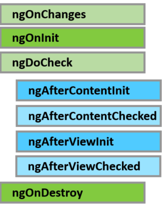

**Angular** полностью управляет процессами происходящими в компоненте и над ним: создание, рендеринг, связывание данных и удаление. Мы в свою очередь можем вклиниться в процесс с помощью хуков/триггеров (**lifecycle hooks**) для каждого из событий.

Какие существуют хуки?

- **ngOnChanges** - при изменении входных значений
- **ngOnInit** - при инициализации компонента (один раз)
- **ngDoCheck** - при вызове механизма обнаружения изменения (**change detection**)
- **ngAfterContentInit** - после вставки компонента в страницу (один раз)
- **ngAfterContentChecked** - один раз при инициализациии контента и каждый раз при изменении входящих параметров
- **ngAfterViewInit** - аналогичен ngAfterContentInit, только для представления
- **ngAfterViewChecked** - аналогичен ngAfterContentChecked, только для представления
- **ngOnDestroy** - перед тем, как Angular удалит компонент со страницы

Все хуки реализуются с помощью соотвествующего интерфейса в классе компонента(либо директивы), соотвественно: OnChanges, OnInit, DoCheck, AfterContentInit, AfterContentChecked, AfterViewInit, AfterViewChecked, OnDestroy.

Например для реализации **ngOnInit** мы реализуем интерейс OnInit:

\[javascript\] import { Component, OnInit, OnDestroy } from '@angular/core'; @Component({ selector: 'my', template: 'My Component!' }) export class MyComponent implements OnInit { ngOnInit() { console.log('onInit'); } } \[/javascript\]

Используется **ngOnInit** обычно в 2х случаях:

- чтобы выполнить сложную инициализацию после создания
- чтобы настроить компонент в зависимости от входных параметров

## ngOnChanges

Хук-метод **ngOnChanges** вызывается при обновлении параметров компонента. Первый вызов метода идет до **ngOnInit**, что позволяет задать изначальные настройки и использовать их в инициализации.

## ngOnDestroy

вызывается перед тем, как фреймворк удалит компонент. Хорошее место для отписки от слушателей и отвязки обработчиков событий.

Далее рассмотрим методы, время вызова которых не сразу можно понять из названия.

## ngDoCheck

Мне очень нравится сравнение этого метода **ngDoCheck** с **$watch** в **Angular1**. Другими словами: он будет запускаться всегда, когда выполняется механизм обнаружения изменений (change detection). 

## ngAfterContent && ngAfterView

Тут у нас сразу 4 хука: **ngAfterContentInit**, **ngAfterContentChecked**, **ngAfterViewInit** и **ngAfterViewChecked**.

Для понимания отличия давайте сначала разберемся - что такое **View**, а что такое **Content**. View - это представление компонента включающее в себя представления всех дочерних компонентов. А Content - внутреннее содержимое тега компонента, то есть если у вас есть компонент 'my', и он представлен на странице как:

\[html\] <my> 
hello world
 </my> \[/html\]

так вот

\[html\] 
hello world
 \[/html\]

тут и будет **Content**.

Теперь должно стать более понятно что такое  **ngAfterContentInit** и **ngAfterViewInit**. Так же нужно обязательно понимать, что Content инициализируется до View, а View ребенка инициализируется до View родителя. Например у вас есть 2 компонента (один вложенный в другой): сначала отработает метод ngAfterContentInit на родителе, потом ngAfterContentInit на ребенке, потом сработает ngAfterViewInit ребенка и только потом ngAfterViewInit родителя. Подробно проиллюстрированно в консоле на [планкере](http://plnkr.co/edit/UkQ9FVkCPBZCQ22uEzSa?p=preview).

**ngAfterContentChecked** и **ngAfterViewChecked** выполняются при любых изменениях входящих параметров.

Реализацию всех хуков можно посмотреть на вот [этом примере](http://plnkr.co/edit/gx4JMNaolU1jqoDgS5lT?p=preview).
