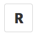

[Runkit](https://runkit.com) - your quick playground just with [node.js](https://runkit.com/npm/) or with some npm modules(like [rxjs](https://runkit.com/npm/rxjs), [md5](https://runkit.com/stevermeister/58da5b4d2317e00014a1c911), etc)
