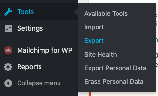
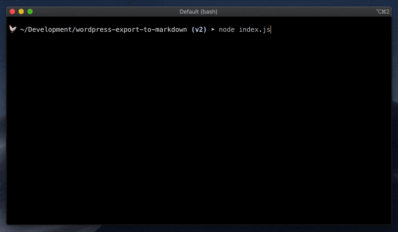

*I hope you know what Scully is, because this post is not about how to start with Scully but example how to migrate your WordPress blog content into Scully.*

## Export posts

First thing you need to do is to export all your post from WordPress. Luckily for us WordPress has functionality to export all your posts into XML.
You can find option in navigation:



You can check more details on WordPress [official documentation](https://wordpress.org/support/article/tools-export-screen/).

After this operation you have your XML file, but it's still XML and you would like to have MD.

## XML to MD

To convert XML into MD within keeping blog format we can use [wordpress-export-to-markdown](https://github.com/lonekorean/wordpress-export-to-markdown) tool:



Answer prompt questions carefullly because for you ideally to keep the same structure of URLs.

Convertion finished? Wel done! Now you have you md files with images. doesn't Scully support images with md?

## Blog images and Scully

Bad news for you. For now (8.06.20) Scully does not recognise images. 
Good news - Scully has plugin system. 
This article not about Scully plugins, so if you want to know how to write Scully plugins please check [this](https://samvloeberghs.be/posts/custom-plugins-for-scully-angular-static-site-generator) article  by [Sam Vloeberghs](https://twitter.com/samvloeberghs), it's great!

## Scully plugin to copy images

We want scully to copy images from source of md files to compiled html files. For this we will create a small image plugin:

```typescript
const { registerPlugin } = require("@scullyio/scully");
const fs = require("fs");

function imageFilePlugin(raw, route) {
  return new Promise((resolve) => {
    const src = route.templateFile;
    const dest = "./dist/static/images/" + route.data.sourceFile;
    fs.copyFile(src, dest, (err) => {
        if (err) console.log(err);
        console.log(`${route.templateFile} was copied to ${dest}`);
        resolve('');
      }
    );
  });
}
// You can put more image file extensions here
registerPlugin("fileHandler", "png", imageFilePlugin);
registerPlugin("fileHandler", "jpg", imageFilePlugin);
registerPlugin("fileHandler", "gif", imageFilePlugin);
module.exports.imageFilePlugin = imageFilePlugin;
```

and now we need to include this plugin to Scully config (scully.config.js):

```js
require('./src/image.scully.plugin');

exports.config = {
  ...

```

## Parse tags from XML

Ideally to have tags from your posts as well. By defalt [wordpress-export-to-markdown](https://github.com/lonekorean/wordpress-export-to-markdown) does not parse tags. I've created [PR](https://github.com/lonekorean/wordpress-export-to-markdown/pull/40) for it. Not sure how fast it's gonna be merged, so if you need tags you can use [my forked version](https://github.com/stevermeister/wordpress-export-to-markdown).

## Double enconding

It looks like there is an issue with WordPress XML Export, if you have many non-latin symbols, for example, you are writing your posts in other language it will be encoded 2 times, so when I did export (with [wordpress-export-to-markdown](https://github.com/lonekorean/wordpress-export-to-markdown)), I changed this line: 


