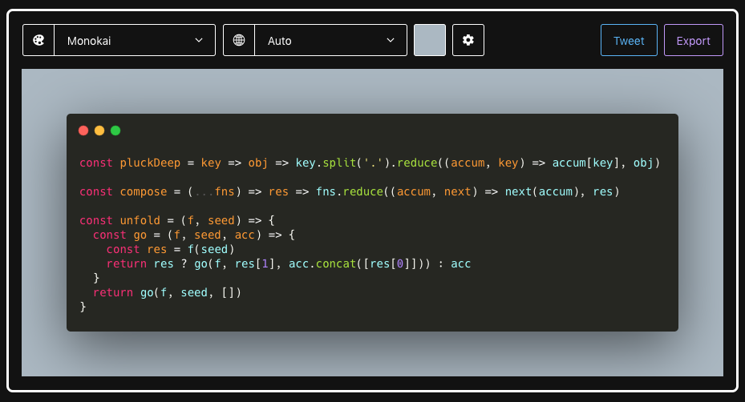

One more service to bookmarks, finally I have something simple to make code snapshots for presentation.

&t=monokai&wt=none&l=auto&ds=true&dsyoff=20px&dsblur=68px&wc=true&wa=true&pv=56px&ph=56px&ln=false&fm=Hack&fs=14px&lh=133%25&si=false&es=2x&wm=false)
